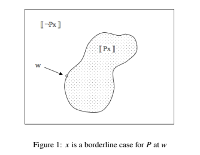

as i write this, i've now graduated, but i still think the main idea behind my senior thesis is both plausible and interesting. i mostly 
stumbled upon it. it uses topological epistemic semantics to model Williamson's epistemicism using the concept of knowability while preserving the KK principle (which has been traditionally discarded by proponents of epistemicism). for more of an introduction: it has to do with the problem of vagueness, which is usually motivated via the Sorites paradox. here's what i wrote:

---

This paradox has two observations. One: there exist clear cut cases for most predicates. Let $B(x)$ be defined as 'the entity $x$ is bald.' Clearly, if $x$ has 0 hairs on his head, then $B(x)$ is true. Two: if there is a clear cut case, some other imperceptibly different case should have the same truth value. Let $x$ be some clear cut case of baldness - say $x$ has 4 hairs on his head. And let $y$ have 1 more hair on his head than $x$. it seems to be the case that $y$ is also, without need for inspection, bald. This is usually formalized in the following way:

$$
\begin{aligned}
&(1) & P(0) \\
&(2) & \forall n (P(n) \rightarrow P(n+1)) \\
\hline 
& & \forall n P(n)
\end{aligned}
$$

in the derivation above, the first and second premises correspond to the first and second observations. But, if you substitute 'B' in for 'P', this implies that a man with a full head of hair (say, $n := 1,000,000$ ) is bald. A sorites series is just some series of Modus Ponens that follows this formula to such an effect, like claiming that a man with a full head of hair is bald. Now, we can state what it means to be vague: a predicate, $P$, is vague just in case it can be used to generate a Sorites series.

---

the last line isn't exactly true -- the Sorites paradox is only one lense through which to view vagueness. the [Stanford philosophy article](https://plato.stanford.edu/entries/vagueness/) is worth reading for more of a background.

the Sorites paradox might bug you because it seems to imply that either premise (2) is incorrect, i.e. there is some clearly bald person such that adding one hair to their head makes them clearly not bald, or there is something wrong with classical logic, i.e. we should adopt another logic with a different semantics that muddies the cases between 'clearly bald' and 'clearly not bald.'

my thesis models vagueness as an epistemic phenomena regarding *knowability*. in parallel, i argue that my proposed model for vagueness also clearly fits a brand of epistemicism (the idea that preserves classical logic but claims that premise (2) is actually false; if a man is clearly bald with $n$ hairs on his head, it may be the case that he is clearly not bald with $n+1$ hairs on his head). the only problem is that these boundaries, such as the one between $n$ hairs and $n+1$ hairs, are unknowable.

for reference, i'll let the thesis introduce what i take to be the central tenant of epistemicism, margin for error principles: 

---

As defined by Williamson, "A *margin for error principle* is a principle of the form: 'A' is true in all cases similar to cases in which 'it is known that A' is true. Which margin for error principles obtain depends on the circumstances." The idea behind this is intuitive. We might think of similar cases as cases in which the differences are imperceptible, or nearly so. For instance, if you walk into a room with 5 people in it, and you are trying to estimate how many people are in the room, the required degree of similarity might be determined by some trace amount of atoms. But if you walk into a stadium filled with people and you are faced with the same task, the degree of similarity could include dozens of people, as your senses are only so perfect - there could be people around the corner or behind a wall that you do not see; in this case, knowledge may be categorized as "inexact." So, since we want knowledge to be *reliable*, to say 'it is known that A' is just to say that, in all reasonably similar cases, 'A' is true. 

---

i realize i'm condensing things haphazardly. at this point it'd be good to gain a basic familiarity with the epistemic interpretation of the topological semantics for modal logic. a gentle introduction can be read [here](https://arxiv.org/pdf/1803.08193.pdf). or, just keep reading and take the math at face value.

using the topological semantics, i define what it means for a predicate $P$ to be vague at a world w as such: 

$$
V_w(P) \text{ iff } \exists x (\neg \square Px \wedge \neg \square \neg Px)
$$

This reads that a predicate $P$ is vague if and only if there is some entity $x$ in its domain such that it's not knowable whether $x$ is $P$ and it's not knowable whether $x$ is not $P$. Thus $x$ is referred to as a "borderline case," and the existence of borderline cases implies a predicate is vague. it's worth reflecting on the geometric interpretation here. Assume that $$int( [\![Px]\!] )$$ is non-empty. Also, observe that, in classical logic, $$[\![Px]\!] = [\![\neg Px]\!]^\complement$$. This gives the following picture for a vague predicate's borderline case: 

w actually rests on the border between $$[\![Px]\!] \text{ and } [\![\neg Px]\!]$$. Any open set $U$, where $w \in U$, will contain other worlds that satisfy both $Px$ and $\neg Px$. A philosophical picture is also painted: learning that a predicate or category is vague is an inductive process - one that follows investigation and common sense. 

now, to tie the topological semantics back to margin for error principles, i let the thesis continue from before:

---

Without directly invoking topological semantics, we could formalize this notion at a world w as follows. 

$$ 
\text{if } w  \models K(A),\text{ then } \exists U \text{ such that } U \subseteq [\![A]\!], U \text{is an open set} 
$$

Here, the open set $U$ just represents some "cluster" of similarity. $[\![A]\!]$ is the positive extension of $A$ - all worlds $w$ such that $'A'$ is true at $w$. However, note that if there is some open set $U$ such that $w \in U,  U \subseteq [\![A]\!]$ then it follows that $w \in int( [\![A]\! )$. Thus we have:

$$ 
\text{if } w \models K(A), \text{ then } w \models \square A \qquad \qquad (Ki)
$$

This simply reads "if 'A' is known, then 'A' is knowable." This should intuitively be the case. Thus, I argue that topological semantics give a straightforward, natural model of the margin for error principle, as the box operator is just a realization of it.

---

we can use this isomorphism to address the Sorites paradox in a way Williamson does not. if you begin to wonder where the knowledge predicate, K, comes from, remember that we are modeling vagueness epistemically, thus the Sorites paradox should correspondingly be on an epistemic level. continuing on: 

---

According to Williamson, margin for error principles describe how our knowledge can be vague. Consider the special case where we have a proposition of the form 'it is known that A'. Now apply a margin for error principle to it. We get: 'it is known that A' is true in all cases similar to cases in which 'it is known that it is known that A' is true. But, as Williamson claims, this can be a more stringent condition than the former. Our knowledge of our knowledge is inexact and subject to larger set of biases. The margin for error might need to be widened as it's impacted by factors such as our "ability to judge reliably." Thus, the $KK$ principle, where $Kp \rightarrow KKp$ for all propositions P, is false. 

Vagueness also gives rise to margin for error principles. Consider a typical vague term like 'heap.' We should have the following, which Williamson labels (!) 

$$
\text{ (!) if we know that n grains make a heap, then n-1 grains make a heap.}
$$

The idea being, again, that we want knowledge to be reliable, so indiscernible differences should be evaluated the same. With the $KK$ principle, and a $K$ operator which needs nothing more than the distribution axiom, we would generate a sorites series for 'known heaps' in the following way:

$$
\begin{aligned}
(K(H(n)) \rightarrow H(n-1) &\implies K(K(H(n))) \rightarrow K(H(n-1))  &  (distribution) \\
										 &\implies K(H(n-1)) 								   & (KK) \\ 
										 &\implies K(H(n)) \rightarrow K(H(n-1))
\end{aligned}
$$

So, with repeated modus ponens one will eventually reach the conclusion that a single grain is a known heap. However, as discussed above, the KK principle does not hold according to Williamson. Each successive iteration requires a widening of the margin of the first known heap as another $'K'$ is added. Thus, after some number of iterations, the antecedent will fail to be true. 

remember, however, that we modeled the margin for error principle differently. and our model does not require denying the KK principle. thus: 

Assume, for the sake of argument, that (!) is true. Thus, as before, we have $\forall n, w \models K(H(n))$, and from $(Ki)$, we get $\forall n, w \models \square H(n)$.  

But if the predicate in question is vague, we have 

$$
V_w(H) \text{ iff } \exists n (\neg \square H(n) \wedge \neg \square \neg H(n))
$$

Thus, for some $n$, $ \neg \square H(n)$ and $\square H(n)$, which is a contradiction. So we must abandon the assumption, (!). Philosophically, this motivates a perspective where the discretization of 'grains' is too gross a scale for the similarity measure. Somewhere between $n$ and $n-1$ grains, for some $n$, there is a switch between being a heap and not. This may not be unreasonable - consider larger scale vague terms such as 'several.' Clearly it is not the case that, if we know '2 people is not several' and '4 people is several', it follows that '3 people is several' is both true and false. Topological semantics dictate that the required similarity metric does not have to be quantized to the integers. And the center of each 'measurement' or 'cluster' need not be the entity at hand (in this case, $n$-people). Similarly it may be the case for terms such as 'heap.' it could just be that $n$-grains is on the edge of some $U$ in the positive extension of the 'heap' predicate as applied to the number of grains $n$, and stepping to $n-1$ grains brings the entity outside of interior of the positive extension at our world $w$ -- namely, $w \notin int( [\![H(n-1)]\!] )$. 

thus we have the basics of the model for vagueness. the rest of the thesis attempts to analyze higher order vagueness by sketchily equating the 'definitely' operator from supervaluationism with the 'box' operator from the topological semantics. it's not fully convincing but it seems like the plausible analog and the results are interesting: we'd expect that, for any proposition p, either 'definitely definitely p' is true or 'definitely not definitely p' is true. but this is not true for the 'box' operator - it leaves out the worlds in the border in the picture above -- meaning we have second order vagueness (it's vague whether some predicates are vague). thus, our semantics are vague. so, for some predicates, any purported borderline case is no longer borderline in a slightly different context (world contained in the measurement *U* containing *w*). i.e., borderline cases are highly controversial; this might actually make sense given predicates like 'x is *art*' or 'x is *beautiful*.' however, since the interior of the interior is the interior, *higher* orders of vagueness are semantically identical to this second-order vagueness, making it much more precise than the higher order vagueness of supervaluationism or fuzzy logic.

this is all worth investigating more. i did not begin to open the box of worms involved in cogently mixing modal operators with quantification (does this mean you quantify only over the entities at each domain? do you assume all predicates have the same domains at all worlds?).

